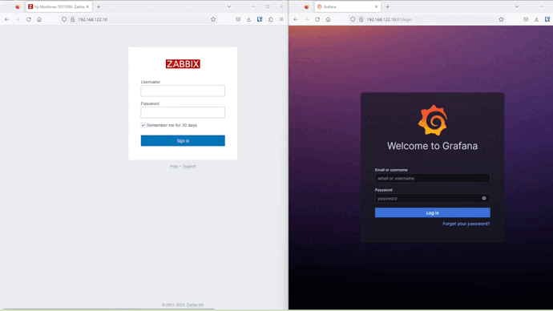
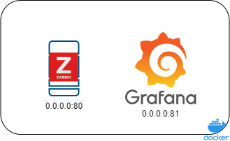
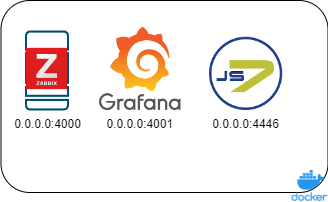

# 

# Stacks de monitoreos básicos útilizando herramientas Open Sources

**Índice**

1. [Descripción](#descrip)
2. [environment-alpha](#acc)
3. [environment-beta](#knowerr)
 

## Descripción

Este repositorio contiene los compose necesarios para crear diferentes stacks de monitoreos útilizando docker compose. 

Cuyo objetivo es inicializar rapidamente diferentes entornos de desarrollo y pruebas basados en microservicios.
Parametrizando de la mejor manera posible.

## 1. environment-alpha

Implementado con Zabbix y Grafana.

 

## 2. environment-beta

Ambiente para integrar Zabbix y Grafana con el software de automatización sos-berlink JS7.

 

