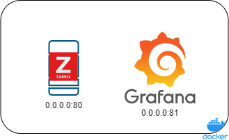

# 

# Stack de monitoreo básico útilizando Zabbix/Grafana

**Índice**

1. [Descripción](#descrip)
2. [Accesos y credenciales](#acc)
 

## Descripción<a name="descrip"></a>

Este repositorio tiene los manifiestos necesarios para crear un stack de monitoreo útilizando docker compose, utilizando los siguientes microservicios:

1. zabbix/zabbix-server-mysql
2. zabbix/zabbix-web-apache-mysql
3. zabbix/zabbix-web-nginx-mysql
4. zabbix/zabbix-agent
5. zabbix/zabbix-web-service
6. mysql:8.0-oracle
7. busybox
8. postgres
9. grafana/grafana
10. redis

 

## Accesos y credenciales<a name="acc"></a>

Las credenciales para cada servicio son:

Credencial Zabbix
```
User: Admin
Password: zabbix
```

Credencial Grafana
```
User: admin
Password: zabbix
```

